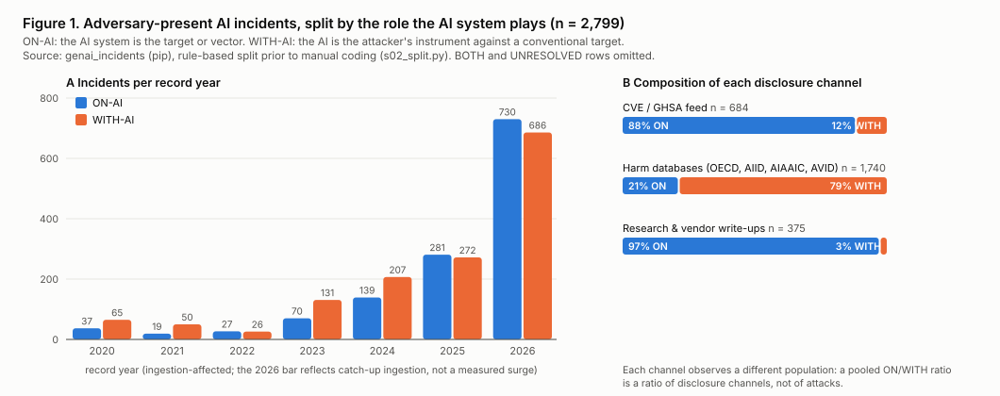

# Attacker methodology in real-world AI incidents

<!-- Working draft. Every number below is produced by a script in this folder; regenerate with `make all`
     (or run s01..s04 in order) before quoting. Blocks marked TODO are yours to fill. -->

## Abstract

<!-- TODO: 150–200 words. Current skeleton: -->
Public analysis of AI incidents is organised around harm (MIT AI Risk Repository tracker and Delphi
priorities; Li et al. AIES 2025). We ask instead how adversaries operate. Using genai_incidents as a
sampling frame (not as coding material), a rule-based pre-split finds **2,832** adversary-present
incidents and partitions them into attacks **on** AI systems (**1,339**) and attacks **with** AI
(**1,460**). The two populations arrive through nearly disjoint disclosure channels (88% of CVE-sourced
adversary incidents are on-AI; 78% of harm-database incidents are with-AI), which is the first finding
and the central validity threat. We describe the coding frame, sampling design and statistics for a
~500-incident hand-coded study.

## 1. Introduction

<!-- TODO: motivation paragraph in your words. Anchors to cite: -->
- Harm view is well served: MIT AI Incident Tracker (5 taxonomies over AIID); MIT Delphi, 272 experts,
  18 of 24 domains ≥10% catastrophic probability; Li et al. AIES 2025 (499 GenAI incidents, who/what/how).
- Attacker view is not: ATLAS case studies are few and mostly exercises; the only OWASP-vs-incident test
  (Lambros 2026) found weighted κ 0.20 with an interval crossing zero and three unobservable entries.
- Why now: agentic incidents of 2025–26; vendor threat-intel reports now describe attributed campaigns.
- <!-- TODO: your contribution statement (3 bullets). -->

## 2. The genai_incidents corpus — what the data is

Source: `s01_overview.py` → `out/s01_overview.md`, sections A–B.

- Open index of publicly disclosed AI security incidents, vulnerabilities and red-team findings;
  pip `genai-incidents` 2.12.0, full JSON at tag v2.12.0 (sha256 in `external/PINS.json`).
- **15,666** records, **1,915** landmark; 1983–2026; median description 281 characters.
- Six taxonomies mapped (OWASP LLM/ASI, NIST AI RMF, MITRE ATLAS, MAESTRO, VERIS); all heuristic.
- Premise (its own words): an index over existing trackers, not a census; labels are heuristic, not
  measured prevalence; public-disclosure and English-language frame.

| Table | Where |
|---|---|
| Source mix, channel, category, tier, quality, year | `out/s01_overview.md` §B |
| attack_vector, severity, OWASP, CWE breakdowns | `out/s01_overview.md` §B2 |

Key numbers for the text: CVE/GHSA 51.5% of records, harm databases 45.4%, research 3.1%;
`attack_vector = other` 27.5%; category vulnerability-disclosure 51.3% vs real-world 45.7%.

<!-- TODO: one paragraph on why it is still the right sampling frame (controlled vector, CVE link,
     category flag, resolvable primary reference on every row). -->

## 3. What an independent re-labelling already shows (incident-rank-validation)

Source: `s01_overview.py` → `out/s01_overview.md` §C. Artifacts read, engine not run.

- 7,714-record snapshot (May 2026), **6,207** resolve to current IDs; 91% labelled by the LLM pass.
- Gold set 1,200 rows: adjudicator overrode the model on **553** (46%); **444** (37%) out of scope.
- Recall per entry 0.02–0.49 (security stratum); ai-harm stratum uncalibrated; weighted κ 0.203.
- Table: vote rank vs data rank vs share of labels, per entry — `out/s01_overview.md` §C.

<!-- TODO: 3–4 sentences: what this licenses (exclusion list, seeds, expectation-setting) and what it
     does not (prevalence claims; anything about method). -->

## 4. Dissecting the frame: ON-AI vs WITH-AI

Source: `s02_split.py` → `out/split.json`, `out/s02_split.md`; `s03_figures.py` → `out/fig1_on_with.svg`.

Deciding question: **whose asset is the AI system?** ON-AI = victim's AI subverted. WITH-AI = attacker's
AI pointed at a conventional target. BOTH and UNRESOLVED carried separately for hand review.

| Population | n | share of adversary frame (95% bootstrap CI) |
|---|---|---|
| ON-AI | 1,339 | 47.3% (45.4–49.0) |
| WITH-AI | 1,460 | 51.6% (49.8–53.4) |
| BOTH | 33 | 1.2% |
| UNRESOLVED | 179 | — (adversary word fired, no role signal; mostly "fraud"/"scam"/"campaign") |

Panel B reading: CVE/GHSA 88% ON · harm-db 78% WITH · research 93% ON. **A pooled ON/WITH ratio is a
ratio of channels, not of attacks.**

Independent check: rank-validation gold labels land on disjoint entry sets — ON-AI rows in the technical
entries (Poisoning, Supply Chain, MCP Tool Exploitation, Prompt Injection), WITH-AI rows in Misinformation
and Weaponized LLM Abuse only; 43% of WITH-AI gold rows are out of scope for an LLM-security rubric.

<!-- TODO: worked example for the edge case (user jailbreaks a model, output used downstream → BOTH). -->

## 5. Preliminary methodology breakdown (rule-based, to be replaced by hand codes)

Source: `s04_methodology.py` → `out/s04_methodology.md`.

ON-AI (n = 1,339): entry point direct prompt 24% / indirect carrier 17% / credential 4% / unstated 47%;
target agent-copilot-MCP 48%, consumer chatbot 18%; software vulnerability present 45%, model behaviour
only 32%; demonstrated rather than realized 23%.

WITH-AI (n = 1,460): deepfake 81%; AI output image 19% / voice 17% / text 8% / video 7% / code 1%;
objective financial fraud 33%, political 12%, non-consensual imagery 9%; 94% real-world.

<!-- TODO: 2 paragraphs interpreting; keep "unstated" shares visible — they are the manual-coding workload. -->

## 6. Coding frame and sampling (planned)

<!-- TODO: paste/trim the 12-field frame. -->
Unit: an identifiable adversary acted with intent, against or by means of an AI system, with a primary
source describing the method. ~500 incidents, stratified by population × year (2023–26) × channel,
ON-AI oversampled. Two coders on 20%, κ per field, rulebook frozen after a 30-incident pilot.

## 7. Statistical methods

- Deterministic rule classification for frame and strata; rule recorded per record; checked against the
  336 gold-labelled rows in the frame.
- Percentile bootstrap (2,000 resamples) 95% CIs on every proportion; Wilson intervals for cells < 30.
- Cohen's κ per coded field (quadratic-weighted for ordered fields), pre-adjudication value reported.
- χ² / Fisher exact for ON-vs-WITH comparisons, Cramér's V, Benjamini–Hochberg at 5% FDR.
- Frequent-subsequence counts over ATLAS tactic sequences (descriptive).
- Temporal claims on primary-source disclosure date only.
- Rank-validation artifacts used one way: out-of-scope exclusion and seed selection.

## 8. Threats to validity

Channel confounding · demonstration inflation (23% of ON-AI) · deepfake dominance (81% of WITH-AI) ·
ingestion artefacts (2026) · heuristic label leakage · attribution scarcity.
<!-- TODO: one sentence of mitigation per item. -->

## References

<!-- TODO: full citations. -->
Li et al. 2025 AIES · MIT AI Risk Repository 2026 (tracker; priorities) · Lambros 2026 arXiv:2608.19266 ·
Pittaras & McGregor 2023 SafeAI · Lee et al. 2024 CHI.
